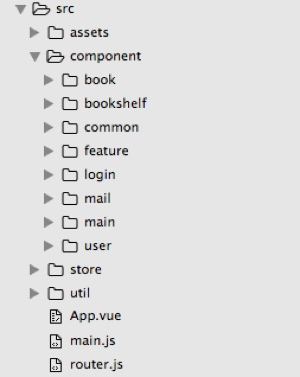
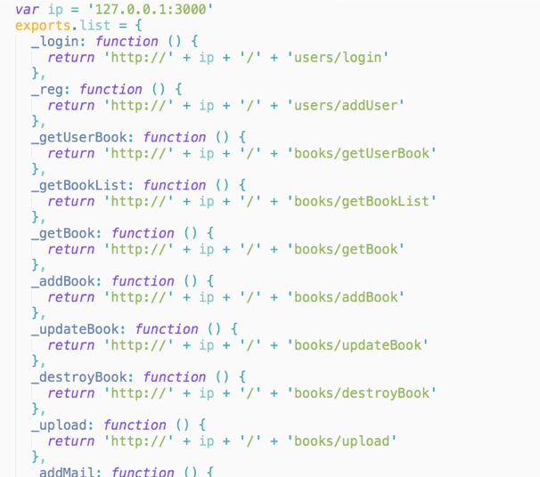
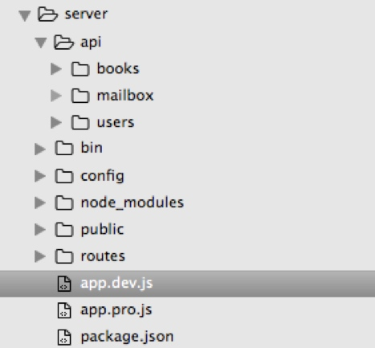
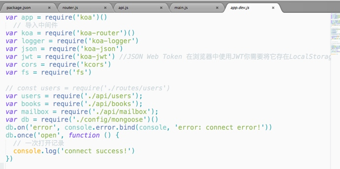
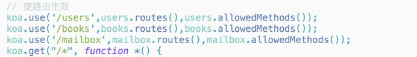
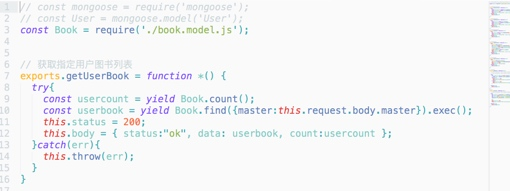
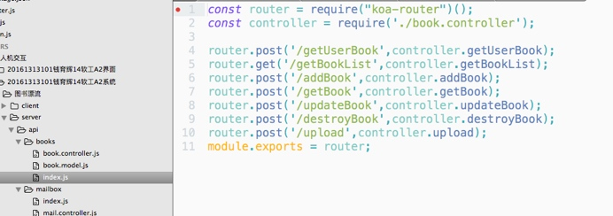
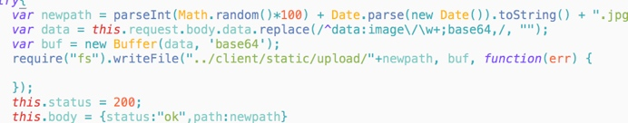

## 背景交代

图书漂流是一款从阅读分享社区中抽离出的APP形态。为了能够适配各种手机机型（如安卓和IPhone）。采用了Html5来模拟App的方式开发。所有一切都向手机APP看齐，因此界面设计也是全部基于传统App样式设计编码。


## 需求分析

用户注册登录
添加书籍
信箱功能
漂流书籍展示
	
## 技术分析

因为考虑到是需要做移动端的应用，分解之后就是需要做一个Spa的响应式页面。因此最终决定前端技术采用Vue.js+Bootstrap+移动端Rem动态计算。整站架构是基于Node环境，尤其前端应用了模块管理技术，Node环境是不可缺少的，因此数据库也选择了轻量型数据库Mongodb，配合Moogoose，将数据库映射成对象进行操作。后端框架采用了Koa.js,它支持自由度比较高的自定义扩展。很多处理函数可以通过中间件的方式加载。
因此整个应用架构是前后端分离的。前端需要一个简单的server服务加载静态资源。后端也需要开启server服务以及数据库服务。
而且后端为了提高开发效率，采用了MVC软件架构模式，将对数据库的操作更加简便化。


## 系统设计思路
图书漂流系统采用前后端分离，前端开发以vue框架为主.
 

配合vue-router可以实现主菜单子页面的动态切换。为了部署方便，在store文件里有api.js，它包含了前端需要所有需要访问的API接口。
 

将系统功能划分为各个组件,并将组件功能与数据库一一对应开发。
 

对于数据库是采用Mongodb，用NODE后端框架KOA来链接。具体方法是在app.js直接链接数据库:
 

然后对后端路由进行匹配
 



每一个数据表都是一个对象
 
 


在controller里加载对象Model并返回后端接口
 

在后端路由中，针对每一个表都暴露增删更改的接口，并将其命名规范化，在前端页面中调用更加直观。
 
 


图片上传功能直接使用node原生的fs写入模块，将获取的图片数据二进制化然后写入到指定文件夹里。
 
 

## 本地搭建

在server目录下（root权限）:

```

安装配置npm install 
命令行运行mongodb
命令行运行node ./bin/www

```

在client目录下（root权限）:

```

安装配置npm install 
命令行运行node build/dev-server.js 并等待生成前端应用
浏览器访问:localhost:8888(谷歌浏览器中开发者工具 将页面模拟Iphone6设备，因为是移动端应用，在PC端显示效果不佳。)

```

演示效果：


